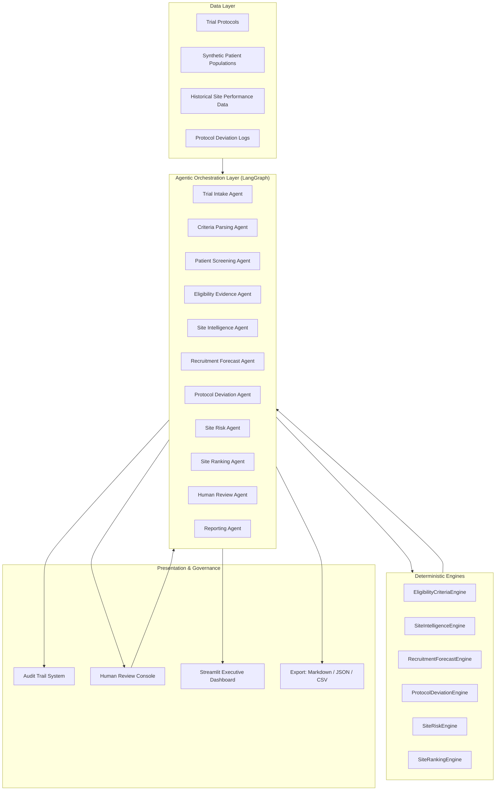
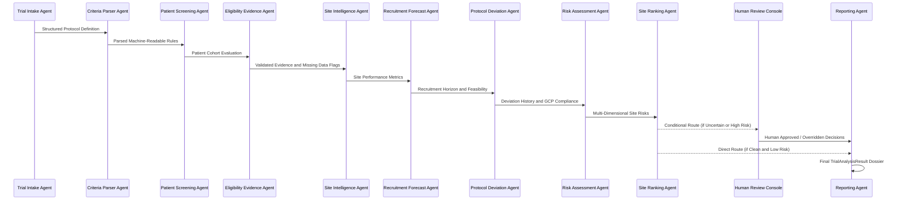

# Clinical Trial Site Selection & Recruitment Agent

[](https://www.python.org/downloads/)
[](https://github.com/langchain-ai/langgraph)
[](https://streamlit.io/)
[-brightgreen.svg)](docs/testing.md)
[](#mandatory-safety-disclaimer)

> **MANDATORY SAFETY DISCLAIMER:**  
> **Synthetic demonstration data — not real clinical trial data.**  
> *This system is an AI-assisted clinical trial decision-support demonstration. It does not provide medical advice, does not replace investigators or ethics committees, and must not be used for real patient eligibility or clinical decisions without appropriate clinical, regulatory, and human review.*

---

## 1. Project Overview & Problem Statement

Clinical trial feasibility, site selection, and patient recruitment represent the single largest operational bottleneck and cost driver in biopharmaceutical development:
- **80% of clinical trials** fail to meet initial enrollment timelines.
- **50% of trial sites** under-enroll or fail to recruit a single patient.
- Manual eligibility screening across complex inclusion/exclusion criteria causes delays, screening errors, and protocol deviations.
- Site selection often relies on subjective relationships rather than multi-criteria performance analytics.

The **Clinical Trial Site Selection & Recruitment Agent** is an enterprise-grade agentic AI decision-support platform designed to automate cohort eligibility screening, detect protocol deviations, calculate deterministic site operational intelligence, and forecast multi-scenario enrollment horizons.

---

## 2. Business Value & Impact

| Challenge | Traditional Approach | Agentic AI Solution |
| :--- | :--- | :--- |
| **Site Selection** | Subjective CRO outreach, months of manual feasibility surveys | Deterministic Multi-Criteria Decision Analysis (MCDA) across historical velocity, compliance, data quality, and capacity |
| **Patient Screening** | Time-intensive chart review prone to human oversight | Deterministic rule engine parsing complex biomarker, lab, and staging criteria with explicit missing-data handling |
| **Recruitment Risk** | Linear optimistic projections resulting in costly trial extensions | Non-linear forecasting with P10/P50/P90 uncertainty intervals and screen failure/dropout friction modeling |
| **Protocol Compliance** | Retrospective monitoring after GCP audit findings | Real-time deviation pattern detection separating empirical facts from analytical risk interpretations |
| **Regulatory Audit** | Fragmented spreadsheets and unrecorded overrides | Complete, immutable agent audit trace with human-in-the-loop sign-off |

---

## 3. Key Capabilities

1. **Deterministic Eligibility Screening**:
   - Evaluates patients against numerical lab ranges, disease staging, biomarker profiles, prior therapies, and prohibited medications.
   - Categorizes outcomes into `ELIGIBLE`, `INELIGIBLE`, and `UNCERTAIN` with human review escalation for missing clinical data.

2. **Site Intelligence & Performance Profiling**:
   - Evaluates historical enrollment velocity, investigator tenure, screen failure rates, dropout attrition, protocol deviation rates, data clarification queries, and startup timelines without LLM hallucination.

3. **Multi-Scenario Recruitment Horizon Forecasting**:
   - Computes expected monthly recruitment, time-to-target horizons (P10 optimistic, P50 expected, P90 conservative), and recruitment shortfall probabilities.

4. **Protocol Deviation & GCP Compliance Monitoring**:
   - Detects severe, recurring, and unresolved deviations.
   - Flags statistical outlier sites ($> \mu + 1.5\sigma$).
   - Explicitly distinguishes empirical **FACTS** from analytical **INTERPRETATIONS**.

5. **Multi-Dimensional Site Risk Assessment**:
   - Configurable weighted risk engine across 6 dimensions: Recruitment, Compliance, Data Quality, Experience, Operations, and Capacity.
   - Fully disclosed mathematical formula breakdown.

6. **Human-In-The-Loop Governance Console**:
   - Review queue for uncertain screening cases and high-risk candidate sites.
   - Four auditable actions: `APPROVE`, `MODIFY`, `REJECT`, `REQUEST_MORE_EVIDENCE`.

7. **Interactive Executive Streamlit Dashboard**:
   - 12 comprehensive tabs featuring interactive Plotly funnels, radars, heatmaps, and enrollment curves.

8. **Automated Dossier Generation & Export**:
   - One-click executive Markdown report, machine-readable JSON schema, and CSV exports.

---

## 4. System Architecture

The platform decouples agentic workflow orchestration from deterministic mathematical and rule calculations:



---

## 5. Multi-Agent Workflow



---

## 6. Scoring & Evaluation Methodology

### Patient Eligibility Matrix
$$\text{Status}(p) = \begin{cases} 
\text{INELIGIBLE}, & \text{if } |C_{\text{triggered}}| > 0 \text{ or } |C_{\text{failed}}| > 0 \\
\text{UNCERTAIN}, & \text{if } |C_{\text{missing}}| > 0 \text{ and } |C_{\text{triggered}}| = 0 \text{ and } |C_{\text{failed}}| = 0 \\
\text{ELIGIBLE}, & \text{otherwise}
\end{cases}$$

### Multi-Criteria Site Prioritization (MCDA)
$$S_{\text{base}} = 0.30 S_{\text{vel}} + 0.20 S_{\text{ops}} + 0.20 S_{\text{exp}} + 0.15 S_{\text{dq}} + 0.15 S_{\text{comp}}$$

$$\text{Risk Penalty} = \left(\frac{\text{Overall Risk}}{100.0}\right) \times 25.0$$

$$\text{Priority Score} = \max(0.0, \min(100.0, S_{\text{base}} - \text{Risk Penalty}))$$

### Recruitment Horizon & Attrition Friction
$$\text{Effective Target} = \frac{\text{Target Enrollment}}{1 - \text{Average Dropout Rate}}$$
$$\text{Expected Monthly} = \left(\sum_{s} \text{Velocity}_s\right) \times (1.0 - 0.5 \times \text{Average Screen Failure Rate})$$
$$\text{P50 Timeline} = \frac{\text{Effective Target}}{\text{Expected Monthly}}$$

---

## 7. Installation & Quickstart

### Prerequisites
- Python 3.11+
- Git

### Setup Instructions

```bash
# 1. Clone repository
git clone https://github.com/Venkat-Padimi/ClinicalDrugTrails.git
cd ClinicalDrugTrails

# 2. Install dependencies
pip install -r requirements.txt

# 3. Launch Streamlit Executive Dashboard
streamlit run app.py
```

The application will be accessible at `http://localhost:8501`.

---

## 8. Running the Automated Test Suite

The test suite validates domain models, deterministic engines, LangGraph orchestration, human review state transitions, and export formats:

```bash
python -m pytest tests/
```

Expected output:
```
tests/integration/test_end_to_end.py .
tests/unit/test_audit.py ..
tests/unit/test_eligibility.py ....
tests/unit/test_screening.py .
tests/unit/test_screening_audit.py ......
tests/unit/test_site_intelligence.py .
tests/unit/test_recruitment_forecast.py ..
tests/unit/test_recruitment_audit.py ....
tests/unit/test_protocol_deviations.py ...
tests/unit/test_protocol_deviations_audit.py .
tests/unit/test_risk.py ..
tests/unit/test_site_ranking.py .
tests/unit/test_site_ranking_audit.py .
tests/unit/test_human_review.py ...
tests/unit/test_reporting.py ...
tests/unit/test_synthetic_data.py ..
tests/unit/test_workflow.py .
tests/unit/test_models.py .....

============================= 43 passed in 0.73s =============================
```

---

## 9. Dashboard Walkthrough

1. **Executive Summary**: High-level KPI cards (Target, Eligible Pool, Expected Monthly Velocity, Top Site, Average Risk, Timeline).
2. **Trial Overview**: In-depth inspection of protocol metadata, inclusion rules, and exclusion rules.
3. **Patient Recruitment**: Screening funnel and regional pool breakdowns.
4. **Eligibility Screening**: Searchable patient table with confidence scores and clinical rule explanations.
5. **Site Intelligence**: Radar charts and operational metric comparisons across trial sites.
6. **Site Ranking**: MCDA bar charts and grounded rationales detailing site strengths and weaknesses.
7. **Recruitment Forecast**: Non-linear enrollment projections comparing P10, P50, and P90 trajectories.
8. **Protocol Deviations**: Separation of empirical facts from analytical risk interpretations with severity breakdown.
9. **Risk & Data Quality**: Multi-dimensional risk heatmap and mathematical equation disclosures.
10. **Human Review Console**: Interactive review queue for approving, modifying, or rejecting borderline cases.
11. **Agent Audit Trace**: Chronological log of agent actions, execution latencies, and data provenance.
12. **Reports & Export**: Download buttons for Executive Markdown report, JSON schema, and CSV datasets.

---

## 10. Limitations & Project Boundaries

- **Synthetic Data**: Operates entirely on synthetic test patients and simulated historical site data.
- **Decision-Support Scope**: This platform does not provide medical advice or replace institutional ethical/investigator review.
- See [docs/limitations.md](docs/limitations.md) for complete details.

---

## 11. Supplementary Documentation

- [docs/architecture.md](docs/architecture.md) — Comprehensive architectural specifications.
- [docs/methodology.md](docs/methodology.md) — Mathematical formulas and decision logic.
- [docs/agent_workflow.md](docs/agent_workflow.md) — Detailed agent roles and LangGraph orchestration.
- [docs/data_dictionary.md](docs/data_dictionary.md) — Complete synthetic data schema.
- [docs/testing.md](docs/testing.md) — Automated testing matrix and verification results.
- [docs/limitations.md](docs/limitations.md) — System boundaries and regulatory disclaimers.
