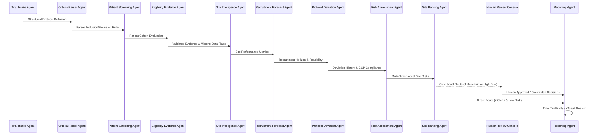

# Multi-Agent Workflow Specification

## Agent Roles & Graph Nodes

The multi-agent architecture is orchestrated through an explicit **LangGraph StateGraph** connecting 11 specialized agent nodes:

---

## Node Descriptions

### 1. `trial_intake_node`
- Ingests protocol parameters: target enrollment, development phase, deadline, version, and therapeutic area.
- Emits intake audit event.

### 2. `criteria_parser_node`
- Validates machine-readable rule definitions across age, staging, biomarkers, lab thresholds, and prohibited medications.

### 3. `patient_screening_node`
- Evaluates synthetic cohort records against parsed criteria.
- Classifies each subject as `ELIGIBLE`, `INELIGIBLE`, or `UNCERTAIN`.

### 4. `eligibility_validation_node`
- Inspects evidence completeness and identifies missing lab values.
- Prepares escalation queue for human review.

### 5. `site_intelligence_node`
- Computes operational scores (velocity, experience, compliance, data quality, capacity).

### 6. `recruitment_forecast_node`
- Projects P10, P50, and P90 enrollment curves, calculates screen failure overhead and dropout attrition.

### 7. `protocol_deviation_node`
- Categorizes deviations (LOW, MEDIUM, HIGH, CRITICAL).
- Distinguishes empirical facts from analytical interpretations.
- Detects statistical site outliers ($> \mu + 1.5\sigma$).

### 8. `risk_assessment_node`
- Calculates multi-dimensional risk scores and mathematical breakdowns for each site.

### 9. `site_ranking_node`
- Applies MCDA ranking to produce prioritized candidate site lists.
- Determines whether conditional human escalation is required.

### 10. `human_review_node`
- Manages human-in-the-loop review queue for uncertain patients or high-risk sites.
- Records explicit reviewer ID, rationale, and override values.

### 11. `reporting_node`
- Compiles the final immutable `TrialAnalysisResult` object for UI rendering and export.
