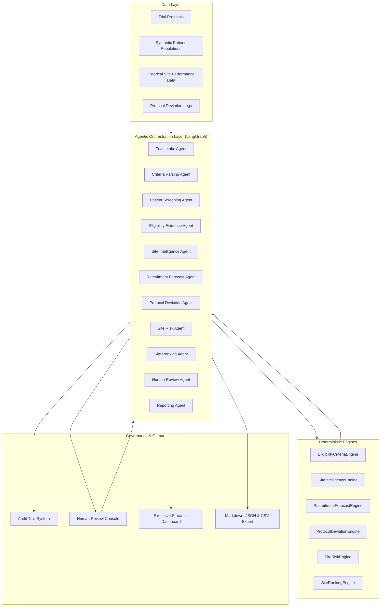

# System Architecture

## Overview

The **Clinical Trial Site Selection & Recruitment Agent** is architected as an enterprise-grade agentic decision-support system. It decouples high-level agentic orchestration (handled via **LangGraph**) from deterministic mathematical calculations and clinical rule evaluations (handled by isolated domain engines).

---

## Architectural Principles

1. **Deterministic Rule Authority**:
   No Large Language Model (LLM) or probabilistic component is permitted to assign patient eligibility, calculate site ranking scores, determine risk levels, or project enrollment timelines. All evaluations are executed by transparent, unit-tested deterministic engines.

2. **Full Audit Traceability**:
   Every state transition, agent recommendation, data provenance snapshot, confidence score, and operational warning is logged immutably to the `AuditTrail`.

3. **Human-In-The-Loop (HITL) Governance**:
   Uncertain cases (such as missing laboratory values or borderline inclusion criteria) and high-risk candidate sites are systematically escalated to the Human Review Console. Overrides require user identity, timestamping, and clinical justification.

4. **Synthetic Data Isolation**:
   The system operates exclusively on synthetic demonstration data. Every entity carries explicit synthetic labeling and disclaimers to prevent misuse in clinical decision-making.

---

## High-Level Component Diagram

---

## Subsystem Details

### 1. Domain Layer (`src/domain/`)
- Uses **Pydantic v2** models with strict typing, validation constraints, and serialization methods.
- Core entities include `Trial`, `Patient`, `EligibilityCriterion`, `PatientScreeningResult`, `TrialSite`, `ProtocolDeviation`, `SitePerformance`, `RecruitmentForecast`, `SiteRisk`, `SiteRanking`, `HumanReviewDecision`, `AuditEvent`, and `TrialAnalysisResult`.

### 2. Provider Layer (`src/providers/`)
- `SyntheticDataGenerator`: Deterministic, seed-controlled generator simulating realistic clinical oncology, cardiology, immunology, and neurology trials with diverse patient cohorts.
- `SyntheticDataProvider`: Disk cache manager ensuring reproducibility and zero external API dependencies.

### 3. Engine Layer (`src/engines/`)
- Pure Python calculation engines without LLM dependencies.
- Handles multi-criteria mathematical weighting, non-linear recruitment friction, statistical outlier detection, and strict clinical logic evaluation.

### 4. Orchestration Layer (`src/workflow/`)
- Utilizes **LangGraph** `StateGraph` with 11 distinct nodes.
- Built-in loop protection (`max_workflow_steps = 25`), conditional branching to human review queues, and automatic fault-tolerance.

### 5. UI & Presentation Layer (`src/ui/`, `app.py`)
- Built with **Streamlit** and **Plotly**.
- Features 12 dedicated tabs, interactive parameter controls, real-time human review forms, and export triggers.
