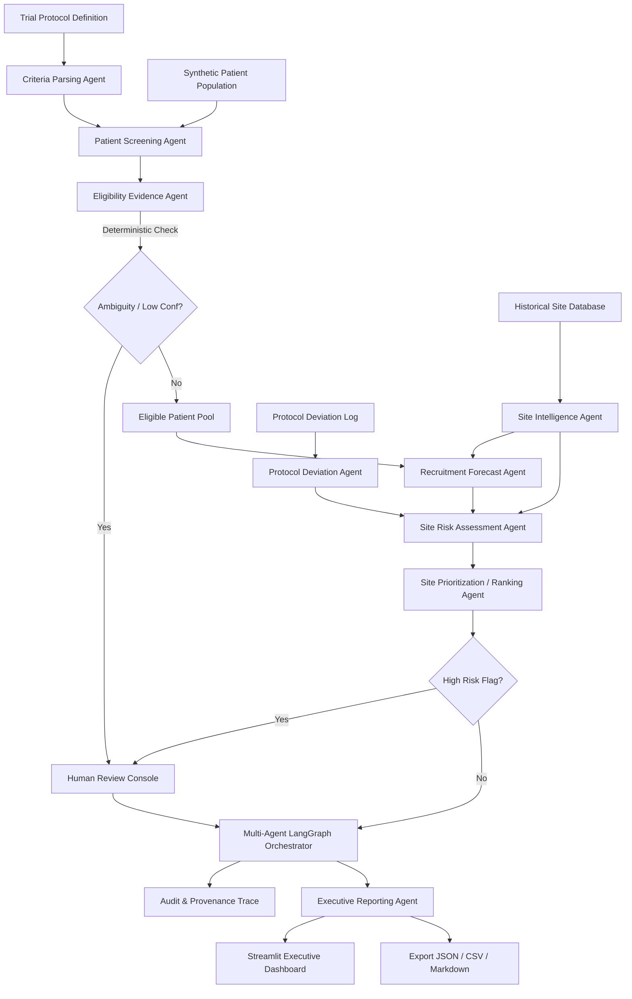

# Implementation Plan: Clinical Trial Site Selection & Recruitment Agent

## Project Vision & System Architecture

The **Clinical Trial Site Selection & Recruitment Agent** is an enterprise-grade agentic AI decision-support platform designed to streamline trial feasibility, patient cohort screening, protocol deviation detection, and deterministic multi-criteria site ranking.

> **CRITICAL DISCLAIMER**:
> This system is an AI-assisted clinical trial decision-support demonstration using **100% synthetic demonstration data**. It does not provide medical advice, does not replace investigators or ethics committees, and must not be used for real patient eligibility or clinical decisions without appropriate clinical, regulatory, and human review.

---

## Architecture Blueprint

---

## 18-Phase Execution Matrix

1. **Phase 1: Project Foundation & Domain Models**
   - Config management with environment overrides
   - Typed Pydantic domain models: `Trial`, `Patient`, `EligibilityCriterion`, `PatientScreeningResult`, `TrialSite`, `EnrollmentRecord`, `ProtocolDeviation`, `SitePerformance`, `RecruitmentForecast`, `SiteRisk`, `SiteRanking`, `HumanReviewDecision`, `AuditEvent`, `TrialAnalysisResult`
2. **Phase 2: Synthetic Data Providers**
   - Diverse synthetic trial protocols (Oncology, Immunology, Cardiology, Neurology)
   - Realistic synthetic patient cohorts (biomarkers, labs, disease stages, comorbidities, consent)
   - Detailed trial sites (investigator history, metrics, capacities, activation timelines)
   - Protocol deviation records (informed consent, drug accountability, visit windows, lab anomalies)
3. **Phase 3: Eligibility Criteria Engine**
   - Deterministic rule parser: numerical ranges, biomarker sets, histology, staging, labs, exclusions
   - Explicit handling of missing data and borderline values yielding `UNCERTAIN`
   - Detailed justification and matched/failed criterion breakdown
4. **Phase 4: Patient Recruitment Screening Agent**
   - Cohort evaluation pipeline
   - Funnel metrics: Screened $\rightarrow$ Eligible $\rightarrow$ Ineligible $\rightarrow$ Uncertain
   - Aggregations by site, region, stage, biomarker
5. **Phase 5: Site Intelligence Engine**
   - Deterministic scoring of historical enrollment velocity, experience, dropout, data queries
   - Site performance profiling without LLM hallucination
6. **Phase 6: Recruitment Forecasting Engine**
   - Multi-scenario projections (P10 conservative, P50 expected, P90 optimistic)
   - Screen failure impact, dropout friction, enrollment horizon calculations
7. **Phase 7: Protocol Deviation Monitoring Engine**
   - Severity classification (LOW, MEDIUM, HIGH, CRITICAL)
   - Recurrence rates, unresolved counts, temporal anomaly detection
   - Clear distinction between objective FACTS and analytical INTERPRETATION
8. **Phase 8: Site Risk Engine**
   - 6-dimension risk matrix: Recruitment, Compliance, Data Quality, Experience, Operations, Capacity
   - Configurable transparent deterministic weightings
9. **Phase 9: Site Prioritization & Ranking Engine**
   - Multi-Criteria Decision Analysis (MCDA) normalized to 0–100 scale
   - Actionable strengths, weaknesses, risk flags, and grounded rationale
10. **Phase 10: Multi-Agent LangGraph Orchestration**
    - StateGraph connecting all nodes with conditional branching
    - Step budget limits, loop prevention, state checkpoints, and deterministic fallback
11. **Phase 11: Human-In-The-Loop Review Console**
    - Decisions: APPROVE, MODIFY, REJECT, REQUEST_MORE_EVIDENCE
    - Complete provenance recording: Reviewer ID, rationale, timestamp, overrides
12. **Phase 12: Streamlit Executive Dashboard**
    - 12 comprehensive tabs covering executive metrics to audit logs
13. **Phase 13: Interactive Plotly Visualizations**
    - Funnels, radar charts, enrollment curves, heatmaps, deviation timelines
14. **Phase 14: Agent Audit Trace**
    - Complete provenance logging with inputs, outputs, confidence, latencies, and warnings
15. **Phase 15: Reporting & Export**
    - Executive Markdown report, structured JSON output, CSV downloads
16. **Phase 16: Automated Testing**
    - Comprehensive unit and integration test suite with pytest
17. **Phase 17: End-to-End Verification**
    - Complete workflow validation and Streamlit app startup check
18. **Phase 18: Documentation & Quality Delivery**
    - Comprehensive README and detailed architecture/methodology docs
